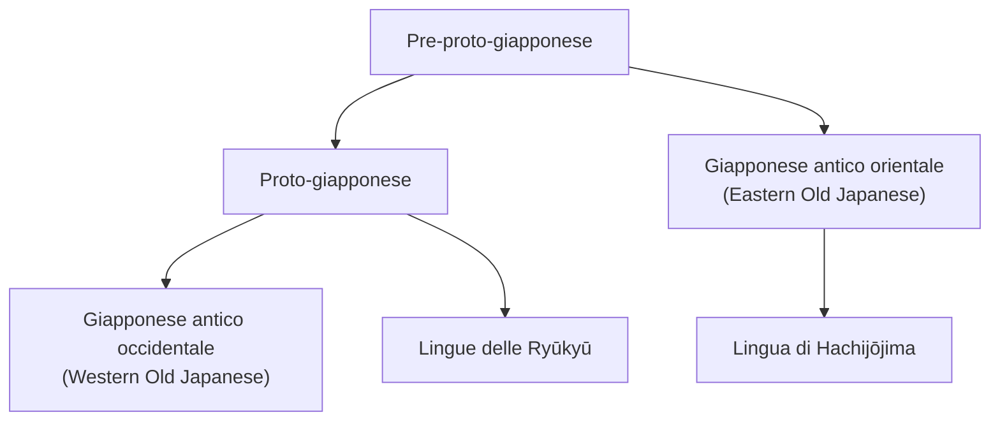

Il giapponese è l’unica lingua tra le più parlate al mondo di cui non si hanno origini certe.
Le [[Fonti del giapponese antico|fonti scritte più antiche]] risalgono all’8° secolo e rivelano una lingua già molto evoluta: è quindi molto difficile stabilire relazioni genealogiche con altre lingue. Inoltre, per come veniva [[Man'yōgana|trascritta]] la lingua, per ricostruire la pronuncia giapponese antica siamo obbligati a basarci su ricostruzioni del cinese medio.
# Prime teorie
- Boller (1857): [[Lingue uralo-altaiche|lingue uralo-altaiche]]
- Chamberlain (1895): lingue ryukyuane

Nel 1908 Fujioka Katsuji compila una lista di tratti distintivi delle [[Lingue uralo-altaiche|lingue altaiche]], molti dei quali condivisi anche dal giapponese. Questa lista è stata criticata perché composta soprattutto da caratteristiche tipologiche (spesso lingue lontane possono avere tratti simili), privative, e perché non utilizza il [[Metodo comparativo|metodo comparativo]].
# Principali teorie
Gli studi fino ad oggi hanno seguito due linee principali:
1. la ricerca di una famiglia d’origine del giapponese e altre lingue
2. la ricerca di due o più lingue che si sono stratificate o mischiate per creare il giapponese
## Teoria altaica
Secondo questa teoria, il giapponese sarebbe legato alla famiglia delle [[Lingue uralo-altaiche|lingue uralo-altaiche]].
Sostenitori:
- Boller (1857)
- Murayama Shinchirō (1957)
	- individua correlazioni tra la grammatica giapponese e quelle del mancese e del tunguso e corrispondenze fonologiche tra proto-altaico e proto-giapponese
- Roy Andrew Miller (1971)
	- analizza le corrispondenze fonologiche tra proto-altaico e giapponese antico; esamina pronomi e numerali di giapponese e coreano
- Martine Robeets (2008)
	- combina ricerche archeologiche e genetiche; ipotizza un’origine ancora più ampia (teoria transeuroasiatica)
### Correlazione con il coreano
Sempre in ottica [[Lingue uralo-altaiche|altaica]], il giapponese e il coreano sarebbero “lingue sorelle”, data la presenza di molti tratti simili.
- Ōno Susumu (1957)
	- propone una lista di corrispondenze fonologiche tra parole giapponesi e coreane (poi criticata perché poche appartengono al [[Lessico nativo|lessico di base]])
- Samuel Martin (1966)
	- elabora una lista di 320 paralleli lessicali tra giapponese e coreano
- John Whitman (1985)
- Alexander Vovin (2010)
	- sostiene che giapponese e coreano si siano influenzate a vicenda, ma senza essere imparentate
### Correlazione con le lingue delle Ryūkyū
Non ci sono dubbi sul fatto che il giapponese e le [[lingue delle Ryūkyū]] siano imparentate, dato che si riscontrano corrispondenze sistematiche di [[Fonologia#Fonema|fonemi]] e [[Morfologia#Morfema|morfemi]].

| Giapponese contemporaneo | Lingua di Yorontō (Ryūkyū) | Significato |
| ------------------------ | -------------------------- | ----------- |
| ___ka___*m*___e___       | ___ha___*m*___i___         | ‘tartaruga’ |
| *am*___e___              | *am*___i___                | ‘pioggia’   |
| ___h___*ana*             | ___p___*ana*               | ‘fiore’     |
| ___h___*i*               | ___p___*i*                 | ‘fuoco’     |
| *kum*___o___             | *kum*___u___               | ‘nuvola’    |
| ___ho___*n*___e___       | ___pu___*n*___i___         | ‘osso’      |

Sostenitori:
- Chamberlain (1895)
- Hattori (1959)
	- identifica il giapponese e le lingue delle Ryūkyū come due rami evolutivi del [[#Proto-giapponese|proto-giapponese]]
### Correlazione con la lingua ainu
Per la vicinanza geografica è stata proposta una relazione con la lingua ainu, ma si è accertato che tra le due lingue sono avvenuti solamente dei prestiti linguistici.
## Teorie di genesi stratificata o mista
Queste teorie ipotizzano che il giapponese sia il risultato dell’unione di più lingue entrate in contatto tramite migrazioni avvenute in epoca preistorica. Le più probabili lingue coinvolte appartengono alle [[Lingue uralo-altaiche|lingue altaiche]], originarie del continente, e alle [[Lingue austronesiane|lingue austronesiane]], originarie del Pacifico del Sud.

- Shinmura (1911) lingua altaica ibridata alle lingue austronesiane
- Polivanov (1924)
- Ōno Susumu (1957)
- Murayama & Ōbayashi (1973) sostrato austronesiano e superstrato altaico
- Kawamoto (1980) sostrato altaico e superstrato austronesiano
## Proto-giapponese
Molti studiosi (Serafim, Samuel, Frellesvig, Whitman, ecc.) si sono concentrati sul ricostruire la proto-lingua del giapponese (proto-giapponese o *Japonic*), considerando le lingue parlate nell’arcipelago ([[giapponese antico occidentale]], [[lingue delle Ryūkyū|lingue delle Ryūkyū]], [[giapponese antico orientale]], [[lingua di Hachijōjima]]) come varietà di essa.

Secondo Hokama (1981), le lingue delle Ryūkyū si sarebbero differenziate dal giapponese antico tra il 2° e l’8° secolo.
### “*Peninsular Japonic*”
Per alcuni una varietà di proto-giapponese sarebbe esistita anche in una parte della penisola coreana. “peninsular Japonic”. Questa teoria si basa sull’analisi di alcuni toponimi registrati nella cronaca coreana *Samguk sagi* 삼국사기 三国史記, che presentano somiglianze semantiche e fonetiche con il giapponese antico.

| [[Fonogramma]] | Pronuncia in cinese medio | Pronuncia in sino-coreano | Corrispondenza in giapponese antico |
| -------------- | ------------------------- | ------------------------- | ----------------------------------- |
| 旦              | *tan*                     | *tan*                     | *tani* ‘valle’                      |
| 那勿             | *na-mjut*                 | *namwul*                  | *namari* ‘valle’                    |
| 美              | *mij*                     | *may*                     | *mi₁* ‘acqua’                       |

Questa teoria naturalmente si accorda con quelle che sostengono un’[[Teorie sulle origini del giapponese#Correlazione con il coreano|origine comune di giapponese e coreano]].
Sostenitori:
- Pellard
- Beckwith
- Ramsey
- Lee
## Teorie screditate
- Ōno Susumu (1980) correlazione con le lingue dravidiche (tamil)
# ttt
proto eastern japonic? > Hachijōjima e altre & Giapponese antico orientale (libri 14 azuma uta e 20 sakimori uta del manyoushu) da cui discende lingua di Hachijōjima